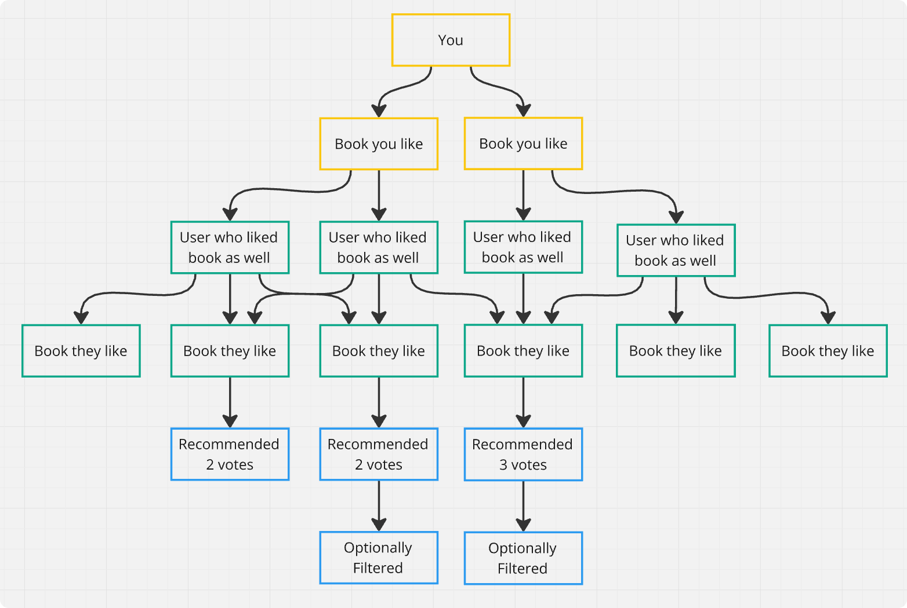

<h1 align="center">📖 📚<br/>Advanced Goodreads Filters<br/>and Recommendations</h1>
<br/>
I'm not happy about the possibilities for filtering and getting recommendations on
goodreads. If you know some python, you can use this library to write simple little
scripts to filter goodreads for you.

Filters books in lists and shelves, or makes recommendations based on your previous
reads. By using the custom callback for filters, you can have very powerful and
fine-grained control over which books to include and remove from your recommendations,
based on many different custom criteria. An example implementation is available with
`strict_filter`.

Downloads are cached in the `goodreads_cache` directory, so the next time you run your
script, it will be a lot faster.

If this tool stops working, please try to make a backward-compatible fix, so that old
cached files are still working, and create a pull request.

When `parse_args` of `recommend` or `bootstrap_list_service` is `True`, you can use
`--help` to display some command line options when running your script.

There are various methods for your own custom filters available in the `Book` class.

Sometimes parsing a page can fail, the scraper should usually continue doing its job
and ignore that particular page.

Requires python 3.11 or newer.

```bash
sudo apt install python3-bs4
git clone https://github.com/sezanzeb/goodreads-recommender.git
cd goodreads-recommender
pip install -e .
```

# Recommendations Based on Previous Reads

```python
#!/usr/bin/env python
from goodreads_recommender.bootstrap import recommend
from goodreads_recommender.filters.strict_filter import strict_filter


def main():
    # Cookie extracted from browser requests. I don't know if goodreads eventually
    # blocks users who scrape their website. Use at your own risk. The cookie and
    # the `user_id` don't have to be of the same user, the cookie is just needed to
    # scrape profile pages.
    cookie = '...'

    recommend(
        user_id=1234,
        cookie=cookie,
        output_file="./recommendations.txt",
        verbose=True,
        # optional:
        book_filter=strict_filter(
            important_genres=["fantasy", "adult"],
            avoid_genres=["robots", "aliens"],
            require_audiobook=True,
        ),
        number_of_recommendations=20
    )


if __name__ == "__main__":
    main()
```

The result in recommendations.txt is sorted by how much a particular book is
recommended, starting with the best one.

Truncated example output from recommendations.txt:

```
# Raw
25307.Robin_Hobb                   41452-the-farseer-trilogy (6)      77197.Assassin_s_Apprentice        1995    4.18    fantasy, fiction, h...
4763.John_Scalzi                   40789-old-man-s-war (15)           51964.Old_Man_s_War                2005    4.23    science-fiction, fi...
153394.Suzanne_Collins             73758-the-hunger-games (8)         2767052-the-hunger-games           2008    4.34    young-adult, fictio...
58.Frank_Herbert                   45935-dune (20)                    53764.The_Great_Dune_Trilogy       1979    4.37    science-fiction, fi...
...

# Filtered
25307.Robin_Hobb                   41452-the-farseer-trilogy (6)      77197.Assassin_s_Apprentice        1995    4.18    fantasy, fiction, h...
4763.John_Scalzi                   40789-old-man-s-war (15)           51964.Old_Man_s_War                2005    4.23    science-fiction, fi...
58.Frank_Herbert                   45935-dune (20)                    53764.The_Great_Dune_Trilogy       1979    4.37    science-fiction, fi...
346732.George_R_R_Martin           43790-a-song-of-ice-and-fire (11)  13496.A_Game_of_Thrones            1996    4.44    fantasy, fiction, e...
...
```



# Filtering Lists and Shelves

```python
from goodreads_recommender.bootstrap import bootstrap_list_service
from goodreads_recommender.filters.strict_filter import strict_filter

list_service = bootstrap_list_service(
    book_filter=strict_filter(
        important_genres=["fantasy", "adult"],
        avoid_genres=["robots", "aliens"],
        minimum_rating=3,
        require_audiobook=True,
    ),
    verbose=True,
    output_file="./output.txt",
)

# Add a "Fantasy" section to output.txt, using books from various lists and shelves.
# They are going to be filtered in accordance to above configuration.
# Repeat this step multiple times with different configurations to extend output.txt.
list_service.scan_books(
    name="Fantasy",
    list_ids=["176302.Best_Cozy_Fantasy_Books"],
    shelf_ids=["fantasy"],
)

# More `list_service.scan_books` calls to your hearts desire may follow. The result
# will be appended to output.txt.
```
The result in output.txt is sorted by author and series. It looks similar to the output
of recommendations, with the `name` as the healdine of each section.

## Development

```bash
sudo apt install mypy pylint black
black goodreads_recommender
pylint -E goodreads_recommender
mypy goodreads_recommender
```
